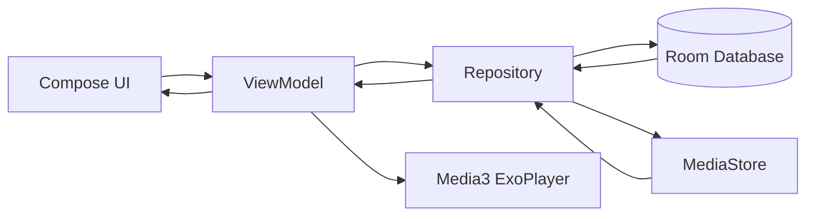

# 🎵 LocalWave - Local Music Player

A modern offline music player built with **Kotlin**, **Jetpack Compose**, and **Media3** that allows users to browse, play, and manage audio files stored locally on their Android devices.

LocalWave focuses on providing a beautiful, distraction-free music listening experience with dynamic album-based theming, light and dark themes, favorites management, playback controls, notification controls, and persistent playback state.

---

## 📲 Available on Google Play

<p align="center">
  <a href="https://play.google.com/store/apps/details?id=kr.android.musicplayer">
    
  </a>
</p>

<p align="center">
  <a href="https://play.google.com/store/apps/details?id=kr.android.musicplayer">
    Download LocalWave on Google Play
  </a>
</p>

**Current Version:** `1.0.1`

---

# 📚 Table of Contents

- [📱 App Overview](#-app-overview)
- [✨ Features](#-features)
- [🛠 Tech Stack](#-tech-stack)
- [🏗 Architecture](#-architecture)
- [🔄 App Flow](#-app-flow)
- [📸 Screenshots / Demo](#-screenshots--demo)
- [📱 Android APIs & Permissions](#-android-apis--permissions)
- [📂 Project Structure](#-project-structure)
- [🎯 Use Cases](#-use-cases)
- [🚧 Future Improvements](#-future-improvements)
- [🔒 Privacy](#-privacy)
- [📌 Project Status](#-project-status)
- [🤝 Freelancing & Portfolio](#-freelancing--portfolio)
- [📄 License](#-license)

---

# 📱 App Overview

## What is LocalWave?

LocalWave is an offline Android music player that automatically discovers audio files stored on a device and provides a smooth music playback experience.

The app eliminates the need for subscriptions, internet connectivity, or external services by focusing entirely on locally stored music.

## Problem It Solves

Many modern music apps are heavily dependent on internet connectivity and streaming services.

LocalWave solves this by providing:

- Completely offline music playback
- Fast local song discovery
- Dynamic album artwork experience
- Persistent playback state
- Lightweight and privacy-friendly listening

---

# ✨ Features

### 🎶 Music Playback

- Play local audio files
- Pause and resume playback
- Next / Previous controls
- Seek through songs
- Volume controls

### ❤️ Favorites

- Mark songs as favorites
- Dedicated Favorites screen
- Persistent favorites using Room Database

### 🎨 Dynamic UI

- Album artwork extraction
- Dynamic color palette generation
- Album-based theming
- Animated vinyl record player

### 🌗 Light & Dark Themes

- Dedicated light and dark themes
- Separate theme styling for each appearance
- Dynamic album-based colors within the player experience

### 🔄 Playback Modes

- Shuffle Mode
- Repeat One
- Repeat All
- Repeat Off

### 📱 User Experience

- Mini player
- Bottom sheet music player
- Smooth Compose animations
- Scroll-aware mini-player visibility

### 💾 Persistence

- Playback position restoration
- Last played song restoration
- Favorite songs persistence

### 🔔 Notifications & Background Playback

- Playback notification
- Play/Pause actions
- Next/Previous controls
- Background playback
- Media session integration
- Notification media controls

### 🚀 Performance

- Local storage scanning
- Efficient media loading
- Reactive UI updates

---

# 💡 Why LocalWave?

LocalWave is designed for users who already have their own music library and want a focused listening experience without relying on streaming services.

### 🌐 Completely Offline

Play music stored on your device without requiring an internet connection or music streaming service.

### 🎨 Dynamic Music Experience

Album artwork influences the player's color theme, creating a visual experience that adapts to the currently playing song.

### ❤️ Favorites

Save songs you love and access them quickly from the dedicated Favorites experience.

### 🔔 Background Playback

Continue listening while using other apps with Android notification and media controls.

### 🌗 Light & Dark Themes

Choose the appearance that suits your environment with dedicated light and dark themes.

### 🔒 Privacy-Focused

LocalWave does not require an account or external web APIs for core music playback.

---

# 🛠 Tech Stack

## Language

- Kotlin

## UI

- Jetpack Compose
- Material 3

## Media

- Android Media3
- ExoPlayer

## Architecture

- MVVM Architecture

## Local Storage

- Room Database
- DataStore Preferences

## Android Components

- ViewModel
- Coroutines
- Flow
- MediaSessionService
- BroadcastReceiver

## Libraries

```gradle
Jetpack Compose
Material 3
Media3 ExoPlayer
Media3 Session
Room Database
Kotlin Coroutines
DataStore
Palette API
Navigation Compose
```

---

# 🏗 Architecture

The project follows the **MVVM (Model-View-ViewModel)** architecture.

## Why MVVM?

- Separation of concerns
- Better maintainability
- Easier testing
- Scalable codebase
- Lifecycle-aware state management

## Architecture Diagram



---

# 🔄 App Flow

### 1. App Launch

- User opens LocalWave
- Audio permissions are requested

### 2. Song Discovery

- MediaStore scans local device storage
- Songs are loaded into Repository

### 3. UI Rendering

- ViewModel updates UI state
- Song list is displayed

### 4. Playback

- User taps a song
- ExoPlayer playlist is created
- Playback begins

### 5. Dynamic Theme

- Album art is extracted
- Palette API generates colors
- UI updates dynamically

### 6. Persistence

- Playback position saved
- Last song saved
- Favorites stored in Room

### 7. Restoration

- App relaunch restores:
  - Song
  - Position
  - Playback state

---

# 📸 Screenshots / Demo

## Permission Dialogs

<p align="center">
  
  
</p>

## Music Player

https://github.com/user-attachments/assets/c694ae9a-c4a8-4675-9e28-d2d917f6042d

## Dynamic Theme Example

https://github.com/user-attachments/assets/8786e13f-97a3-4342-9390-03d488017134

## Favorites Screen

<p align="center">
  
  
</p>

## Repeat Mode

https://github.com/user-attachments/assets/485c03a0-2330-4c93-baa8-7129e1aab82a

## Favourite Playlist

https://github.com/user-attachments/assets/2f1ae229-eb8a-4404-9d48-15f1c1104fb3

## Notification Player

https://github.com/user-attachments/assets/03cc99dc-db70-451d-a276-f24be1435cd5

## Demo Video

```text

YouTube- https://youtu.be/3Trru19tWdI
X - https://x.com/kushalreya/status/2061441387904786607?s=20

```

---

# 📱 Android APIs & Permissions

## External APIs

This application currently does **not use any external web APIs**.

Instead it relies on:

### Android MediaStore

Used for:

- Discovering audio files
- Fetching local media content

### MediaMetadataRetriever

Used for:

- Song metadata extraction
- Album artwork extraction
- Artist information
- Album information

### Palette API

Used for:

- Dynamic color generation from album artwork

### Android Media3

Used for:

- Audio playback
- Media sessions
- Background playback
- Notification media controls

## Error Handling

- Metadata extraction fallback
- Missing artwork fallback
- Missing title fallback
- Permission handling
- Safe playback restoration

---

## Permissions Required

### Android 13+

```xml
READ_MEDIA_AUDIO
POST_NOTIFICATIONS
```

### Android 12 and Below

```xml
READ_EXTERNAL_STORAGE
```

---

## API Keys

No API keys are required.

The application works entirely offline.

---

# 📂 Project Structure

```text
kr.android.musicplayer
│
├── data
│   ├── DatabaseProvider
│   ├── MusicDatabase
│   ├── FavoriteDao
│   └── MusicRepository
│
├── model
│   ├── SongData
│   ├── FavoriteSong
│   └── MusicUiState
│
├── navigation
│   ├── AppNavigation
│   └── Routes
│
├── player
│   ├── MusicPlayerController
│   ├── MusicPlaybackService
│   ├── MusicNotificationManager
│   ├── MusicActionReceiver
│   └── PlayerPreferences
│
├── utils
│   ├── DynamicColors
│   ├── MetadataHelpers
│   ├── Permissions
│   ├── RepeatMode
│   └── TimeConversion
│
├── view
│   ├── SongListScreen
│   ├── FavoriteSongsScreen
│   ├── MusicPlayerScreen
│   └── PlayerBottomSheetScaffold
│
├── view/components
│   ├── AlbumArtSection
│   ├── MiniPlayer
│   ├── MusicSeekBar
│   ├── PlaybackControls
│   ├── SongInfoSection
│   ├── MusicListItem
│   ├── VolumeControl
│   └── TopBar
│
├── viewmodel
│   ├── MusicPlayerViewModel
│   └── MusicPlayerViewModelFactory
│
├── AppDependencies
│
└── MainActivity
```

---

# 🎯 Use Cases

### 🎧 Daily Music Listening

Play local songs without internet connectivity.

### ✈️ Travel

Listen to downloaded music while traveling.

### 🔋 Battery-Friendly Playback

Avoid streaming and reduce data usage.

### 📚 Study Sessions

Offline music without interruptions.

### 🏃 Workout Music

Quick access to locally stored playlists.

### 🎵 Audiophile Collections

Manage and play large local music libraries.

---

# 🔒 Privacy

LocalWave is designed as an offline music player.

- No account required
- No external music streaming
- No external web APIs
- No advertising
- No API keys required
- Music playback is performed from files stored on the user's device
- No cloud service is required for core functionality

Read the full Privacy Policy:

https://sites.google.com/view/localwave-privacy/home

---

# 🚧 Future Improvements

Planned enhancements include:

- Responsive UI improvements for smaller-screen devices
- Search functionality
- Playlist creation
- Playlist management
- Music sorting options
- Equalizer support
- Lyrics support
- Folder-based browsing
- Sleep timer
- Android Auto support
- Material You integration
- Theme customization
- Queue management
- Recently played songs
- Most played songs
- Home screen widgets
- Wear OS support

---

# 📌 Project Status

**Current Version:** `1.0.1`

**Status:** 🟢 Published on Google Play

LocalWave is actively maintained and publicly available on Google Play.

The current release provides an offline music playback experience with dynamic album-based theming, favorites, light and dark themes, background playback, and notification controls.

The next development cycle will focus on improving responsiveness on smaller-screen devices, production bug fixes, playback reliability, and overall user experience.

**Google Play:**

https://play.google.com/store/apps/details?id=kr.android.musicplayer

---

# 🤝 Freelancing & Portfolio

LocalWave is part of my personal Android development portfolio and demonstrates the process of taking an Android application from development through testing and production deployment on Google Play.

It demonstrates:

- Modern Android Development
- Jetpack Compose
- MVVM Architecture
- Media3 Integration
- Room Database
- Reactive State Management

I am open to:

- Android App Development
- Jetpack Compose Projects
- UI/UX Implementation
- App Modernization
- Feature Development
- Freelance Opportunities

Feel free to connect regarding collaborations, freelance work, or Android development projects.

---

# 📄 License

This project is intended for educational and portfolio purposes.

You may fork, learn from, and modify the code according to your needs.
